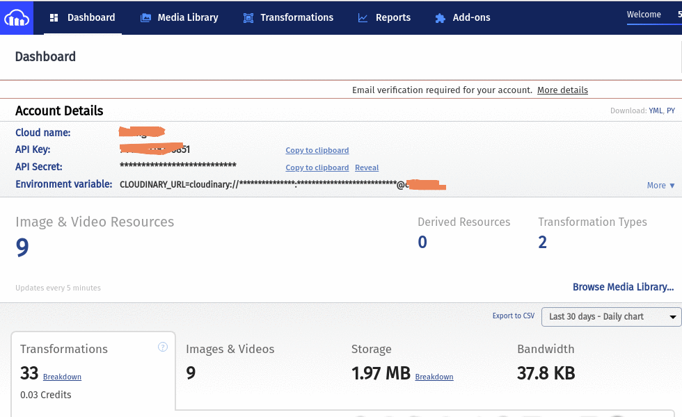

# image-service

🚀🖼️ A minimal service for uploading image.

_Easy way to upload image on Cloudiary._


[](https://app.fossa.io/projects/git%2Bgithub.com%2Fcuongw%2Fimage-service?ref=badge_shield)

## Prepare

- You need a [Cloudiary](https://cloudinary.com) account.
- Get `cloud_name`, `api_key`, `api_secret` from [Cloudiary Dashboard](https://cloudinary.com/console)



## Usage

**domain**: https://image-servicee.herokuapp.com/

**headers**

```
{
  cloud_name: <Your cloud_name>
  api_key: <Your api_key>
  api_secret: <Your api_secret>
}
```

---

### `Upload single image`

**POST** /api/image/upload-single

**body** (form-data)

```
{
  image: <Your image>
}
```

---

### `Upload multi image`

**POST** /api/image/upload-multi

**body** (form-data)

```
{
  images: <Your images>
}
```

Build with 🙌 + ❤️


## License
[](https://app.fossa.io/projects/git%2Bgithub.com%2Fcuongw%2Fimage-service?ref=badge_large)